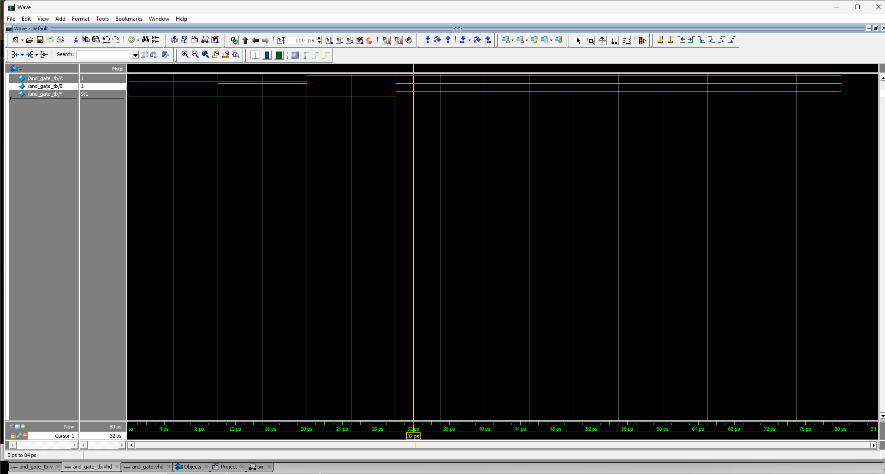

# Day 1 - Verilog Fundamentals

## Topics Covered

- Introduction to Verilog
- HDL and RTL
- Verilog module structure
- Input and output ports
- Wire and reg
- Scalar and vector signals
- MSB and LSB
- Bit select and part select
- Number representation
- Verilog operators
- Bitwise vs logical operators
- Continuous assignment
- Combinational logic
- Verilog comments

## Basic Logic Gates

- AND
- OR
- NOT
- NAND
- NOR
- XOR
- XNOR

## Key Concepts Learned

### Combinational Logic
Output depends only on the present input values and does not require a clock or memory.

### Continuous Assignment
Used to describe a continuous relationship between signals in combinational logic.

### Bitwise vs Logical Operators
Bitwise operators operate on individual bits, while logical operators evaluate operands as logical conditions.

### Verilog Comments
Comments are used to explain code and are ignored by the compiler.

## Practice

- Derived truth tables for basic logic gates
- Learned Verilog operators for basic gates
- Created basic Verilog modules
- Practiced continuous assignments
- Debugged basic Verilog syntax
## Simulation & Verification

The AND gate RTL was verified using a Verilog testbench.

The testbench applied all four possible input combinations and monitored the output using `$monitor`.

### AND Gate Truth Table

| A | B | Expected Y |
|---|---|------------|
| 0 | 0 | 0 |
| 0 | 1 | 0 |
| 1 | 0 | 0 |
| 1 | 1 | 1 |

### Simulation Result

The simulation waveform confirms that the AND gate produces the expected output for all four input combinations.

