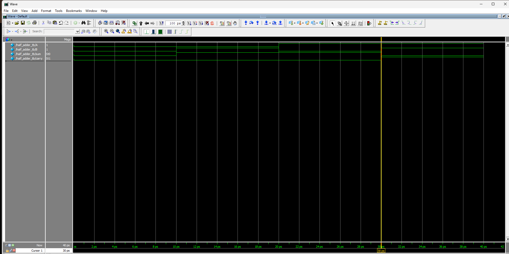
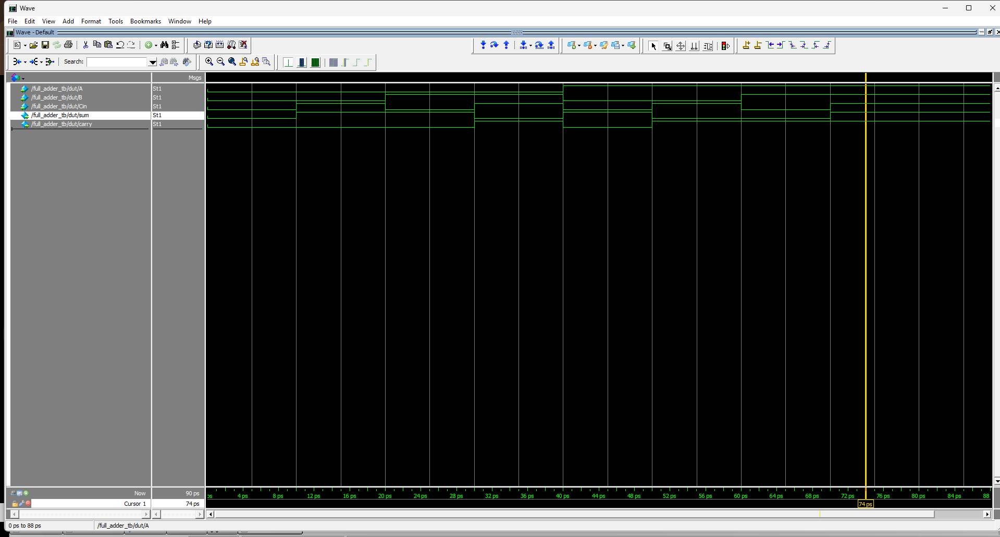

# Day 2 — Verilog Operators, Dataflow Modeling & Arithmetic Circuits

## Overview

Day 2 focused on understanding Verilog operators, continuous assignment, dataflow modeling, and designing basic arithmetic circuits using RTL.

The circuits were developed by starting from the truth table, deriving the Boolean expressions, writing the RTL, creating testbenches, and verifying the results through simulation.

---

# 1. Verilog Operators

## Arithmetic Operators

```text
+   Addition
-   Subtraction
*   Multiplication
/   Division
%   Remainder
```

## Logical Operators

```text
&&  Logical AND
||  Logical OR
!   Logical NOT
```

Logical operators evaluate the operands as logical conditions and produce a 1-bit result.

## Relational Operators

```text
>   Greater than
<   Less than
>=  Greater than or equal
<=  Less than or equal
==  Equal
!=  Not equal
```

These operators compare two values and produce a 1-bit result.

## Bitwise Operators

```text
&   Bitwise AND
|   Bitwise OR
^   Bitwise XOR
~   Bitwise NOT
```

Bitwise operators operate on individual bits.

Example:

```text
A = 1010
B = 1100

A & B = 1000
A | B = 1110
A ^ B = 0110
```

## Shift Operators

```text
<<  Left shift
>>  Right shift
```

Example:

```text
A = 1010

A << 1 = 0100
A >> 1 = 0101
```

## Conditional Operator

The conditional operator is written as:

```text
condition ? true_value : false_value
```

It can be used to describe the behavior of a 2:1 multiplexer.

---

# 2. Continuous Assignment and Dataflow Modeling

The `assign` statement is used for continuous assignment in Verilog.

Example:

```verilog
assign Y = A | B;
```

The output continuously follows the relationship described by the expression.

If the inputs change, the output changes accordingly.

Dataflow modeling is useful for describing combinational circuits because the relationship between inputs and outputs can be directly represented using Boolean expressions.

No clock is required for these basic combinational circuits.

---

# 3. Half Adder

A Half Adder adds two 1-bit binary inputs.

## Inputs

- A
- B

## Outputs

- Sum
- Carry

## Boolean Expressions

```text
Sum   = A ^ B
Carry = A & B
```

## Truth Table

| A | B | Sum | Carry |
|---|---|-----|-------|
| 0 | 0 | 0 | 0 |
| 0 | 1 | 1 | 0 |
| 1 | 0 | 1 | 0 |
| 1 | 1 | 0 | 1 |

## RTL

```verilog
module half_adder(
input A,B,
output sum,carry);

assign sum = A^B;
assign carry = A&B;

endmodule
```

## Testbench

A testbench was created using:

- `reg` for input signals
- `wire` for DUT output signals
- Named port mapping
- `initial` block
- `$monitor`
- Simulation delays
- `$finish`

All four possible input combinations were tested.

## Waveform Verification

The Half Adder was simulated and the waveform matched the expected truth table.



---

# 4. Full Adder

A Full Adder adds three 1-bit inputs.

The third input represents the carry coming from the previous lower bit.

## Inputs

- A
- B
- Cin

## Outputs

- Sum
- Carry

## Boolean Expressions

```text
Sum   = (A ^ B) ^ Cin
Carry = (A & B) | (Cin & (A ^ B))
```

## Truth Table

| A | B | Cin | Sum | Carry |
|---|---|-----|-----|-------|
| 0 | 0 | 0 | 0 | 0 |
| 0 | 0 | 1 | 1 | 0 |
| 0 | 1 | 0 | 1 | 0 |
| 0 | 1 | 1 | 0 | 1 |
| 1 | 0 | 0 | 1 | 0 |
| 1 | 0 | 1 | 0 | 1 |
| 1 | 1 | 0 | 0 | 1 |
| 1 | 1 | 1 | 1 | 1 |

## RTL

```verilog
module full_adder(
input A,B,Cin,
output sum,carry);

assign sum = (A^B)^Cin;
assign carry = (A&B)|(Cin&(A^B));

endmodule
```

## Carry Propagation

When adding multi-bit binary numbers, the carry generated by one bit position must be passed to the next higher bit position.

Conceptually:

```text
FA0 → FA1 → FA2 → FA3
       ↑     ↑     ↑
      Carry Carry Carry
```

The `Cout` of one Full Adder becomes the `Cin` of the next Full Adder.

## Testbench

The Full Adder testbench covered all eight possible input combinations.

## Waveform Verification

The Full Adder was simulated and the waveform matched the expected truth table.



---

# 5. Half Subtractor

A Half Subtractor performs subtraction between two 1-bit inputs.

## Inputs

- A
- B

## Outputs

- Difference
- Borrow

## Boolean Expressions

```text
Difference = A ^ B
Borrow     = (~A) & B
```

## Truth Table

| A | B | Difference | Borrow |
|---|---|------------|--------|
| 0 | 0 | 0 | 0 |
| 0 | 1 | 1 | 1 |
| 1 | 0 | 1 | 0 |
| 1 | 1 | 0 | 0 |

## Understanding Borrow

The important case is:

```text
A = 0
B = 1
```

The subtraction becomes:

```text
0 - 1
```

A borrow is required from the next higher bit.

After borrowing:

```text
10₂ - 1₂ = 1₂
```

Therefore:

```text
Difference = 1
Borrow = 1
```

## RTL

```verilog
module half_subtractor(
input A,B,
output diff,borrow);

assign diff = A^B;
assign borrow = (~A)&B;

endmodule
```

The Half Subtractor RTL and testbench were written and logically verified.

---

# 6. Full Subtractor

A Full Subtractor performs subtraction while considering the borrow coming from the previous lower bit.

The operation can be represented as:

```text
A - B - Bin
```

## Inputs

- A
- B
- Bin

## Outputs

- Difference
- Borrow

## Boolean Expressions

```text
Difference = (A ^ B) ^ Bin
Borrow     = (~A & B) | (~(A ^ B) & Bin)
```

## Truth Table

| A | B | Bin | Difference | Borrow |
|---|---|-----|------------|--------|
| 0 | 0 | 0 | 0 | 0 |
| 0 | 0 | 1 | 1 | 1 |
| 0 | 1 | 0 | 1 | 1 |
| 0 | 1 | 1 | 0 | 1 |
| 1 | 0 | 0 | 1 | 0 |
| 1 | 0 | 1 | 0 | 0 |
| 1 | 1 | 0 | 0 | 0 |
| 1 | 1 | 1 | 1 | 1 |

## Borrow Propagation

In multi-bit subtraction, a borrow generated by one bit position must be passed to the next higher bit position.

Conceptually:

```text
FS0 → FS1 → FS2 → FS3
       ↑     ↑     ↑
     Borrow Borrow Borrow
```

The `Borrow Out` of one Full Subtractor becomes the `Borrow In` of the next Full Subtractor.

## RTL

```verilog
module full_subtractor(
input A,B,Bin,
output diff,borrow);

assign diff = (A^B)^Bin;
assign borrow = (~A&B)|(~(A^B)&Bin);

endmodule
```

The Full Subtractor RTL and testbench were written and logically verified.

---

# 7. Adder vs Subtractor

| Feature | Adder | Subtractor |
|---------|-------|------------|
| Operation | Addition | Subtraction |
| Second output | Carry | Borrow |
| Previous-bit input | Cin | Bin |
| Basic circuit | Half Adder | Half Subtractor |
| Main XOR output | Sum | Difference |

The Full Adder uses `Cin` to include the carry generated by the previous lower bit.

The Full Subtractor uses `Bin` to include the borrow generated by the previous lower bit.

---

# 8. Testbench Concepts Practiced

During Day 2, the following testbench concepts were practiced:

- DUT (Design Under Test)
- Testbench module
- `reg` for procedural input signals
- `wire` for DUT output signals
- Named port mapping
- `initial` blocks
- `begin` and `end`
- Simulation delays using `#10`
- `$monitor`
- `$finish`
- Applying all possible input combinations
- Comparing simulation results with truth tables
- Waveform-based verification

---

# 9. Key Learning Outcomes

By the end of Day 2, I understood:

- Arithmetic, logical, relational, bitwise and shift operators
- Difference between logical and bitwise operators
- Conditional operator `?:`
- Continuous assignment using `assign`
- Dataflow modeling
- How to derive Boolean expressions from truth tables
- How to convert Boolean expressions into Verilog RTL
- How a Half Adder works
- How a Full Adder works
- How carry propagates between multiple bit positions
- How a Half Subtractor works
- How a Full Subtractor works
- How borrow propagates between multiple bit positions
- How to write testbenches for combinational circuits
- How to use `reg` and `wire` correctly in testbenches
- How to verify RTL using simulation waveforms

---

# 10. Verification Status

| Circuit | RTL | Testbench | Verification |
|---------|-----|-----------|--------------|
| Half Adder | Completed | Completed | Simulated & Verified |
| Full Adder | Completed | Completed | Simulated & Verified |
| Half Subtractor | Completed | Completed | Logically Verified |
| Full Subtractor | Completed | Completed | Logically Verified |

---

# Day 2 Status

## ✅ Day 2 Completed

Day 2 covered Verilog operators, continuous assignment, dataflow modeling, and the design of Half Adder, Full Adder, Half Subtractor, and Full Subtractor circuits.

The Half Adder and Full Adder were simulated and verified using waveform analysis. The Half Subtractor and Full Subtractor RTL and testbenches were completed and logically verified.
