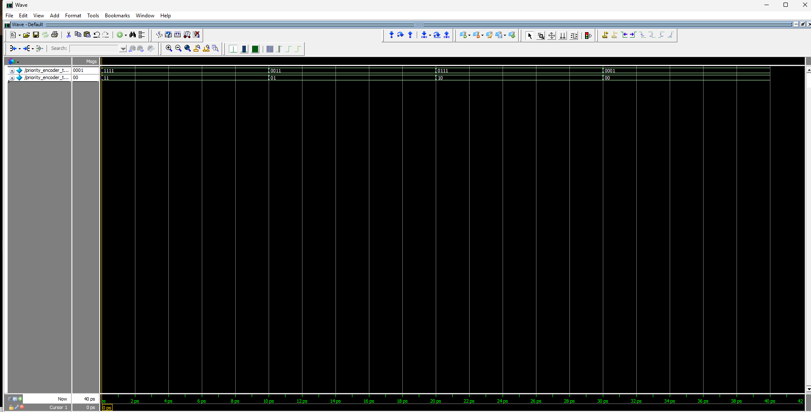

# Day 5 – Combinational Circuits

## Overview

Day 5 focused on understanding and implementing important combinational circuits using Verilog HDL. The main objective was to strengthen the understanding of decoders, encoders, and priority encoders through RTL design, testbench development, simulation, and waveform verification.

The designs were written using behavioral modeling with `always @(*)` and `case` statements.

---

## Topics Covered

- 3×8 Decoder
- 8×3 Encoder
- Priority Encoder
- Behavioral Modeling
- `always @(*)`
- `case` Statement
- Testbench Development
- Simulation and Waveform Verification

---

# 1. 3×8 Decoder

## Description

A 3×8 decoder takes a 3-bit input and activates exactly one of its eight output lines based on the input combination.

### Truth Table

| Select | Output |
|--------|--------|
| 000 | 00000001 |
| 001 | 00000010 |
| 010 | 00000100 |
| 011 | 00001000 |
| 100 | 00010000 |
| 101 | 00100000 |
| 110 | 01000000 |
| 111 | 10000000 |

## Files

- `decoder_3x8.v` – RTL design
- `decoder_3x8_tb.v` – Testbench
- `decoder_3x8 wave.png` – Simulation waveform

## Waveform

---

# 2. 8×3 Encoder

## Description

An 8×3 encoder accepts an 8-bit one-hot input and generates the corresponding 3-bit binary code.

### Truth Table

| Input | Output |
|-------|--------|
| 00000001 | 000 |
| 00000010 | 001 |
| 00000100 | 010 |
| 00001000 | 011 |
| 00010000 | 100 |
| 00100000 | 101 |
| 01000000 | 110 |
| 10000000 | 111 |

## Files

- `encoder_8x3.v` – RTL design
- `encoder_8x3_tb.v` – Testbench
- `encoder_8x3 wave.png` – Simulation waveform

## Waveform

---

# 3. Priority Encoder

## Description

A priority encoder gives priority to the highest-priority active input when multiple inputs are HIGH.

## Files

- `priority_encoder.v` – RTL design
- `priority_encoder_tb.v` – Testbench
- `priority_encoder_wave.png` – Simulation waveform

## Waveform

---

# Simulation and Verification

Each RTL module was tested using a dedicated Verilog testbench.

The verification process included:

1. Applying different input combinations.
2. Observing the corresponding outputs.
3. Comparing simulation results with the expected truth tables.
4. Checking the waveforms in the simulator.
5. Confirming correct combinational behavior.

---

# Key Learning Outcomes

By completing Day 5, I strengthened my understanding of:

- Decoder operation
- Encoder operation
- Priority encoder operation
- One-hot encoding
- Binary encoding
- Behavioral Verilog modeling
- `always @(*)` blocks
- `case` statements
- Testbench writing
- Simulation and waveform analysis

---

# Conclusion

Day 5 provided practical experience in designing and verifying combinational circuits using Verilog HDL. Implementing the 3×8 decoder, 8×3 encoder, and priority encoder helped reinforce the relationship between truth tables, RTL code, testbenches, and simulation waveforms.

The simulation results confirmed the expected functionality of the implemented designs.

---

## Tools Used

- Verilog HDL
- ModelSim / QuestaSim
- GitHub
